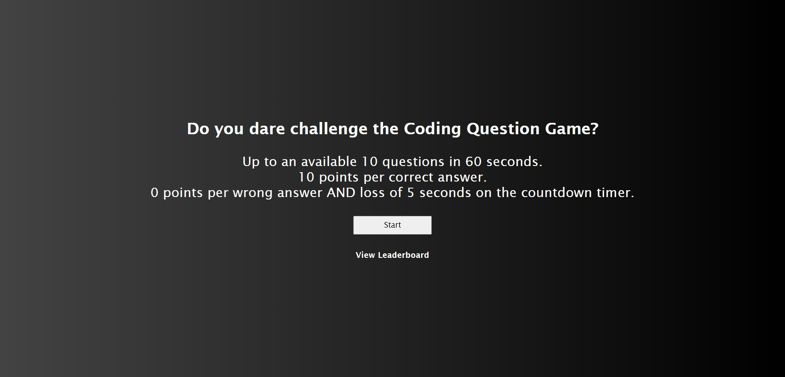

# questionGame

Timed game to test your javascript knowledge

Link to live application: https://misterbham.github.io/questionGame/

The intent of this application is to test the beginner JavaScript knowledge of the user in a fun and interactive game. It could be used as a study tool for any introductory level user to further learn about JavaScript.

It serves as a great practice tool to hone JavaScript logic; specifically vanilla JS logic flow.
The application specifically helped with my learnings of localStorage, function usage and eventListeners.

This was another project that I further learned the importance of order of operations and scoping.
